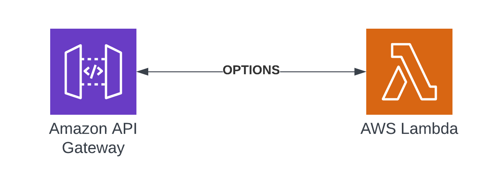
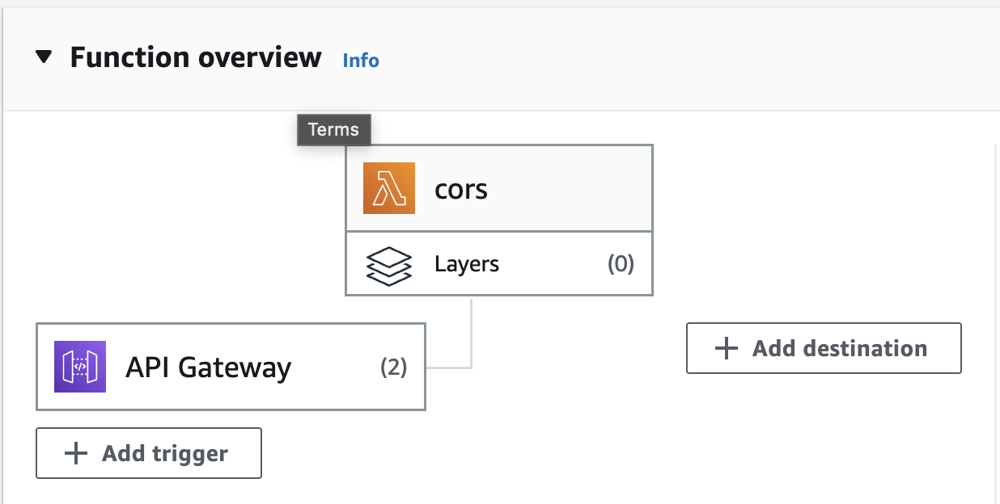

# API Gateway CORS Whitelist



This code demonstrates how to create a whitelist of domains that can be validated when CORS Pre-flight requests are made.

By instrumenting CORS, a browser's request will be validated against an OPTIONS request inside of API Gateway. API Gateway only allows a single domain to be registered or a `*` can be utilized to allow all domains. In the case of more restriction and more flexibility, a whitelist of allowed domains can be built using a Lambda that is executed via a Proxy Integration.

## Deployment Instructions

1. Create a new directory, navigate to that directory in a terminal and clone the GitHub repository:
    ```
    git clone https://github.com/aws-samples/serverless-patterns
    ```
2. Change directory to the pattern directory:
    ```
    cd cdk-api-gateway-cors-whitelist
    ```
3. Install the project dependencies
    ```
     npm install
    ```
4. Deploy the stack to your default AWS account and region
    ```
    make build-and-deploy
    ```

## How it works

Here is what gets deployed into an AWS Account

-   API Gateway that will be the harness for running the CORS request
-   Lambda developed in Go that will run when the OPTIONS request is executed
-   IAM Role that can be used to allow an API Gateway to execute the Lambda
-   SSM Parameter which contains a string field that is a JSON array of whitelisted domains

When deployed there will be an API Gateway created that looks like this.


Additionally, the Lambda that is used to run the checks against the whitelist will look this way.



In a real scenario the Lambda, Role and Parameter are all that is needed and and "export" could be added for each so other APIs could make use of this code. But for the demonstration of the capability, an API Gateway is being used as the test harness.

## Testing

Included in this repository is a `Makefile` that looks like the following

```Makefile
build:
	cdk synth

teardown:
	cdk destroy

build-and-deploy:
	make build
	cdk deploy

test-success:
	make build
	sam local invoke CorsLambdaFunction -t cdk.out/CorsWhitelist.template.json --env-vars environment.json --event src/cors-function/test-events/api-origin.json

test-failure:
	make build
	sam local invoke CorsLambdaFunction -t cdk.out/CorsWhitelist.template.json --env-vars environment.json --event src/cors-function/test-events/api-no-origin.json
```

After running `make deploy` first create a successful record

### Testing Success

`make test-success`

This command will build the stack and the Lambda and then will run the function with an input that will create a `200` response.

### Testing Failure

`make test-failure`

This command will build the stack and the Lambda and then will run the function with an input that will create a `400` response. Notice in this payload of the JSON file that the `Origin` header is missing. That header value is required

### Testing via API Call

Visit API Gateway and find the stage and URL created to execute the endpoint. It will be something like this

`https://<api-id>.execute-api.us-west-2.amazonaws.com/main`

Run this cURL command or use another tool like Postman

```bash
curl --location --request OPTIONS 'https://<api-id>.execute-api.us-west-2.amazonaws.com/main'
--header 'Origin: http://localhost:8000'
```

Notice the `Origin` header. The CDK code will create the Parameter with the following allowed domains.

```javascript
[
    "http://localhost:8000",
    "http://localhost:19006",
    "https://your.custom.domain",
];
```

## Cleanup

1. Delete the stack

```bash
make teardown
```
